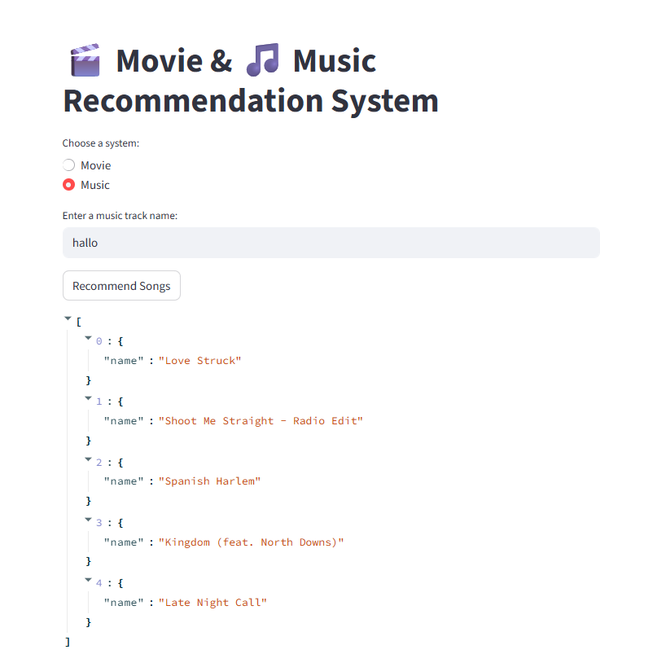
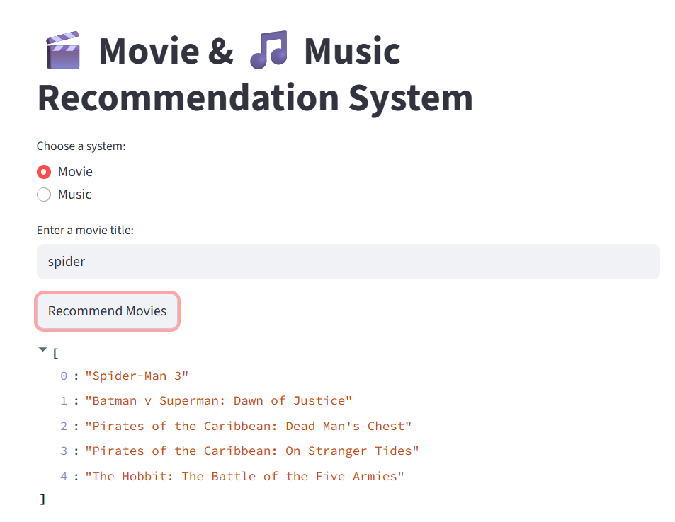

# 🎬🎵 Movie & Music Recommendation System

An AI-powered recommendation system built with **Python**, **scikit-learn**, and **Streamlit**.  
This app allows users to discover similar **movies** and **songs** using **content-based filtering** and **clustering** techniques.
  
  
  
  
 
---

## 🚀 Features

- **Movie Recommendation**  
  - Uses **TF-IDF + cosine similarity** on movie genres.  
  - Suggests similar movies to the one entered by the user.  

- **Music Recommendation**  
  - Uses **K-Means clustering** on audio features (`danceability`, `energy`, `tempo`).  
  - Suggests tracks with similar style.  

- **Interactive Web App**  
  - Built with **Streamlit** for an easy-to-use interface.  
  - Enter a movie title or track name to get recommendations instantly.  

---

## 🖼️ Demo

### 🎵 Music Recommender


### 🎬 Movie Recommender


*(👉 Replace these with real screenshots. Save them in an `assets/` folder in your repo.)*

---

## 📂 Project Structure
```
movie-music-recommender/
│── app/
│ └── streamlit_app.py # Streamlit frontend
│
│── src/
│ ├── content_based.py # Movie recommendation logic
│ ├── music_recommender.py # Music recommendation logic
│ ├── collaborative.py # Collaborative filtering (SVD-based)
│ └── utils.py # Data loading helpers
│
│── data/
│ ├── movies.csv # Movie dataset
│ └── spotify.csv # Music dataset
│
│── assets/
│ ├── movie_recommender.png # Screenshot placeholder
│ └── music_recommender.png # Screenshot placeholder
│
│── requirements.txt
│── README.md
└── .gitignore
```

---

## ⚙️ Installation

Clone the repository:
```bash
git clone https://github.com/YOUR-USERNAME/movie-music-recommender.git
cd movie-music-recommender

Create a virtual environment and install dependencies:
python -m venv venv
venv\Scripts\activate      # On Windows
# source venv/bin/activate # On macOS/Linux

pip install -r requirements.txt

▶️ Usage
Run the Streamlit app:

The app will open in your browser at:
http://localhost:8501

📊 Example Queries

-Movie input: Superman → returns similar action/fantasy movies.

-Music input: Hello → returns songs in a similar cluster of danceability/tempo.

📌 Future Improvements

-Add collaborative filtering with user ratings.

-Enhance fuzzy matching for better title search.

-Deploy online using Streamlit Cloud or Render.

👨‍💻 Author

Developed by Mohamed Dhia Chaouachi
💼 AI Junior Engineer aspirant | Passionate about Recommender Systems & Machine Learning 